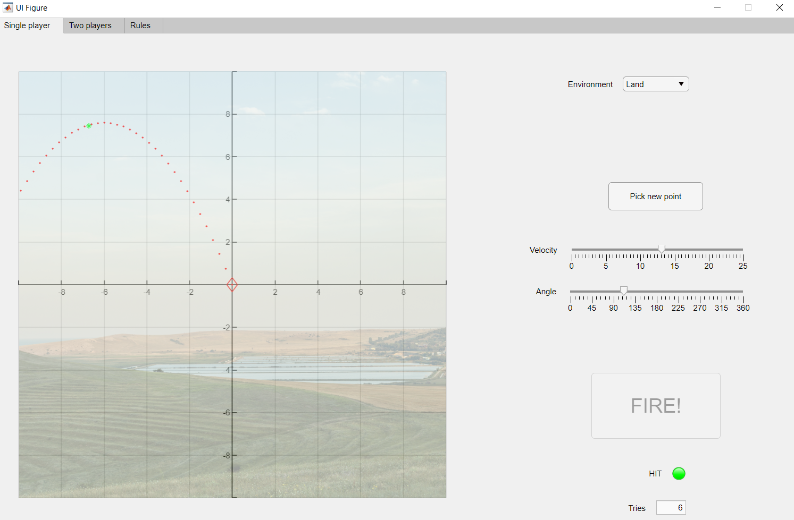

# simple-game-in-matlab
Simple game in Matlab created with App Designer [student project].

Implementation of a very simple physics-based game (similar to Angry Birds but easier and less complicated)

The main goal is to "hit the point" on the map with picking velocity and angle very carefully.

Game has two modes:
- single player (goal: hit the point generated randomly on the map; can be treated as warm-up for the second mode)
- two players (each has life and their goal is to hit the opponent. Each hit takes some life away. The player that defeat enemy will win.)

and several environments in which physics is slightly different:
- land (Earth)
- underwater
- the Moon
- void (cosmic vacuum)

Of course there are some extra rules (included in game section *Rules*).

Screenshot of the game (single player mode):

